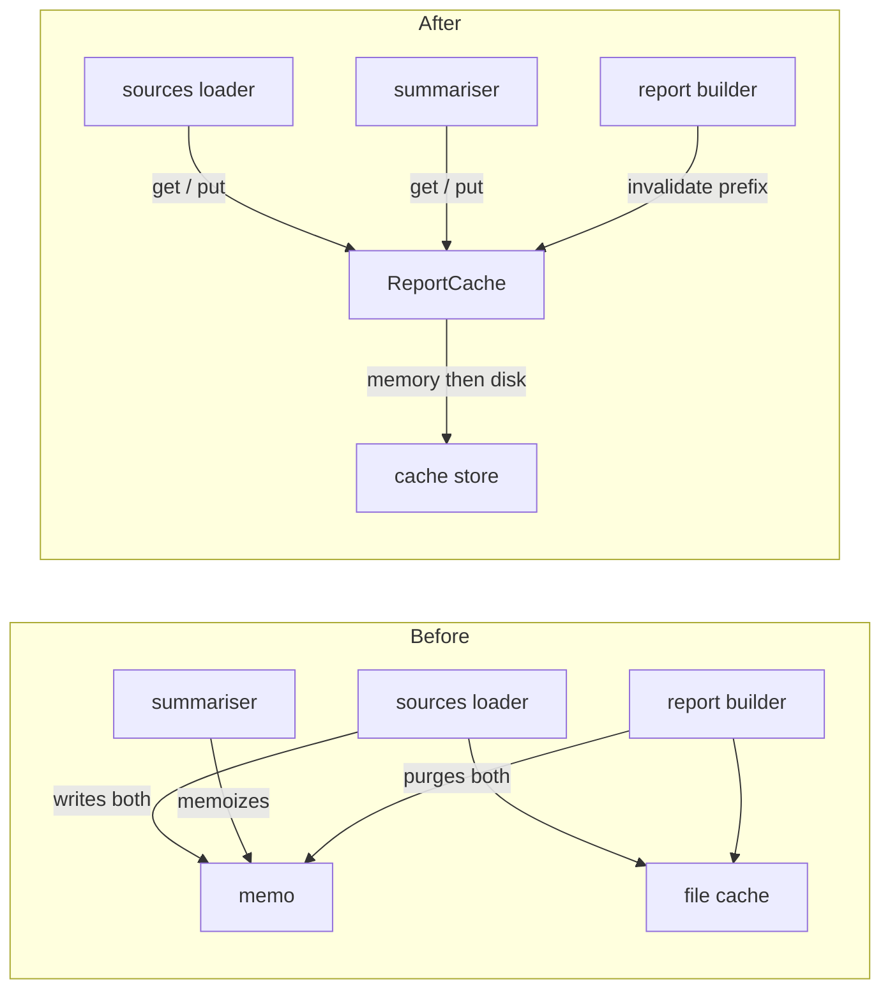

# One report cache with an explicit TTL, no scattered invalidation

Status: approved · Ticket: RG-42

## Problem

Reportgen serves stale summaries after fresh source reads, and a fresh run throws away rows that were seconds old; nobody can say how long a cached value is valid, because nothing decides it. Done means one cache, one place that decides validity, and every existing test green.

## Diagnosis

Every source read goes through two caches that know nothing about each other: an in-process memo keyed by free-form strings and an on-disk file cache. Each caller keeps them in sync by hand — the sources loader writes both and drops the summary memo whenever it loads; the report builder empties both by reaching into each module on a fresh run; the summary module memoizes under a key the loader also knows about. No store carries a time-to-live, so validity is decided by whichever caller last touched the keys.

## Approach

Put one ReportCache in front of every read. It keeps memory in front of disk internally, takes a time-to-live per entry, and offers a single invalidation entry point by key prefix. The loader, the summariser and the report builder receive the cache as a collaborator and stop touching memo or file storage directly; a fresh run invalidates by prefix instead of purging two stores.

- Keep both caches and document the sync rules — rejected. The rules already exist as comments and are already broken in three places; documentation does not stop the fourth caller from adding a fourth rule. It would only become right if the two stores had genuinely different lifecycles, which they do not.
- One store only, in memory, persisted at exit — rejected. It loses the cross-run reuse the file cache exists for, and persisting a memo on exit is the same two-store problem moved to shutdown.

## Decisions

- One cache class owns key naming, not the callers — rejected caller-owned keys because prefix invalidation needs consistent names.
- Memory sits in front of disk inside the cache, not as two caches the caller chooses between — rejected caller choice because that is today's problem.
- Invalidation is by key prefix, not by enumerating keys — rejected enumeration because callers would need to know every key class.

## Design

What replaces what:



- **ReportCache** (new) — the only cache. Memory tier in front of a disk tier, one TTL per entry, one invalidation call by prefix. Owns key naming.
- **sources loader** (changed) — asks the cache for rows, reads disk on a miss, puts with the source TTL. No longer drops anyone else's keys.
- **summariser** (changed) — asks the cache for the summary, computes on a miss, puts with the summary TTL.
- **report builder** (changed) — a fresh run invalidates the source and summary prefixes; nothing else changes.
- **Removed** — the memo module, the file cache as a public collaborator, the loader's forget function.

## Contracts

```python
class ReportCache:
    """One cache for sources and summaries. Memory in front of disk; one TTL per entry; one invalidation entry point."""

    def get(self, key: str) -> object | None:
        """Value if present and not expired, else None. Expired entries are dropped on read."""

    def put(self, key: str, value: object, ttl_seconds: float) -> None:
        """Stores in memory and on disk. ttl_seconds <= 0 raises ValueError."""

    def invalidate(self, prefix: str = "") -> int:
        """Drops every key starting with prefix from both tiers; returns the count."""
```

```python
# sources — signature gains the cache; behaviour: get, read disk on miss, put with SOURCE_TTL.
def load_source(name: str, cache: ReportCache) -> list[dict]: ...

# summary — same pattern with SUMMARY_TTL.
def summarize(name: str, cache: ReportCache) -> dict: ...

# report — fresh=True calls cache.invalidate("source:") and cache.invalidate("summary:").
def build_report(names: list[str], cache: ReportCache, fresh: bool = False) -> str: ...
```

## Guarantees

1. When any module needs cached rows or summaries, then it goes through ReportCache; no module holds its own store.
2. When a value is older than its TTL, then a get returns None and the entry is gone from both tiers.
3. When a fresh report is requested, then every source is re-read from disk exactly once and every summary is recomputed.
4. When a source is re-read, then the summary built from it is recomputed before the report uses it.
5. When the process restarts within the source TTL, then sources are served from disk without a data read.
6. Must not change: report output format, CLI flags, and the behaviour the three existing tests assert — their fixture wiring may be re-pointed at the new cache, their assertions may not.

## Assumptions

- A single TTL per key class (sources, summaries) is enough; no caller needs per-call TTL.
- The summary TTL is never longer than the source TTL; guarantee 4 depends on it.

## Open questions

- Should the disk tier survive `--fresh`, or does fresh mean both tiers? Contracts say both; the owner confirms by milestone 1.

## Risks

- The memo was process-wide; the cache is now a collaborator. Any caller constructing its own ReportCache silently gets its own tiers.

## Out of scope

- Concurrency between processes sharing the disk tier.
- Changing the JSON source format.
