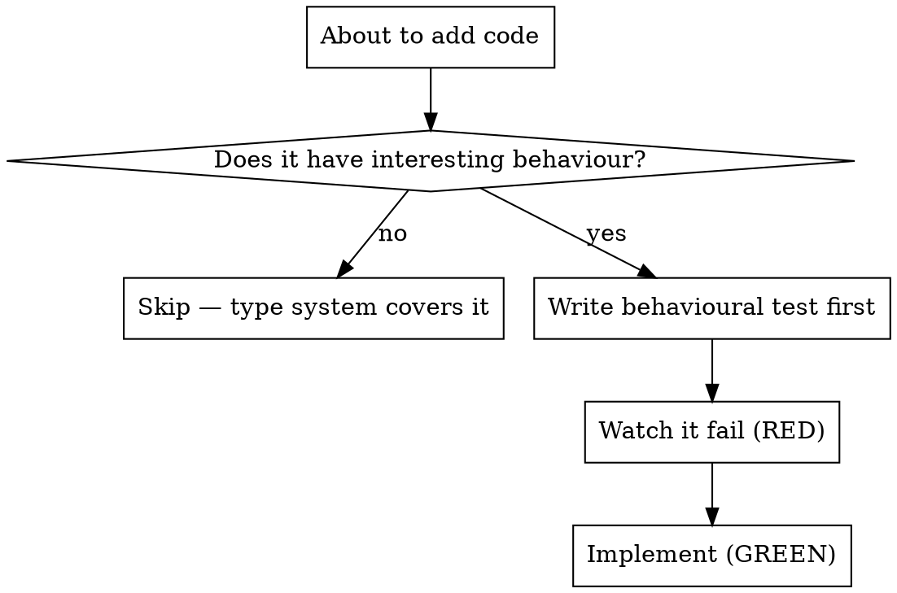

# BDD-Flavoured Testing

Tests describe what the system does for a caller, not what the code is made of. Red-first applies — but at the *behaviour* level, not the structure level.

## Core rules

1. **Test only things with interesting behaviour.** A unit has interesting behaviour if it makes a decision, transforms data non-trivially, has effects, or coordinates collaborators. If it's a data container or thin pass-through, no test.
2. **Tests are use-case-shaped.** Each test reads as a behavioural assertion: *given X, when Y, then Z*. The test name should sound like a sentence.
3. **Red-first applies to behaviour.** Write the behavioural assertion → run it → watch it fail for the right reason → implement → watch it pass. No watching empty classes fail to instantiate.
4. **Prefer integration over unit when realistic.** If a unit's collaborators are fast and simple, exercise them rather than mocking. Mock at the IO boundary (network, filesystem, time, randomness), not at every internal class boundary.
5. **No structural tests.** No `test_enum_has_values`, no `test_dataclass_has_fields`, no `test_class_inherits_from`, no `test_method_exists`. The type system / linter does this.
6. **No test-only methods on production classes.** If a method is only called by tests (e.g. `destroy()`, `reset()`), put it in test utilities, not on the production class.

## When to test



**Has interesting behaviour:**
- Functions that make decisions (validation, routing, dispatching)
- Functions that transform data (parsing, formatting, calculations)
- Functions with effects (network, filesystem, database, mutation)
- Coordinators / orchestrators

**Does NOT have interesting behaviour:**
- Enums (just values)
- Dataclasses, NamedTuples, plain DTOs (just fields)
- Type aliases
- Thin re-exports / shims
- Pure delegation (`def foo(self): return self._x.foo()`)
- Configuration constants

## Test naming

Bad: `test_validate`, `test_user_creation`, `test_returns_correct_value`
Good: `test_empty_email_is_rejected`, `test_when_queue_is_full_new_items_are_rejected`, `test_user_with_admin_role_can_view_audit_log`

A test name should let a reader guess what failed before reading the assertion.

## RED — Write the behavioural test first

```python
# Good
def test_empty_email_is_rejected():
    result = submit_form({"email": ""})
    assert result.error == "Email required"

# Bad — tests the mock, not the behaviour
def test_validator_called():
    mock_validator = MagicMock()
    submit_form({"email": ""}, validator=mock_validator)
    mock_validator.assert_called_once()
```

Watch it fail. Confirm:
- It fails (not errors with a typo)
- The failure message is what you expected
- It fails because the behaviour isn't implemented (not because of plumbing)

If the test passes immediately, you're testing existing behaviour — rewrite the test (unless you're writing characterization tests on purpose; see below).

## Characterization tests (existing code)

When the task is adding tests to code that already works, passing-on-first-run is the expected outcome, not an error. But verify each test actually bites: temporarily mutate the behaviour under test, watch the test fail, restore, watch it pass. A characterization test you never saw red proves nothing.

## GREEN — Smallest implementation

Write just enough to pass. No `if-elif-else` ladder for cases the test doesn't exercise. No premature parameterization. No "while I'm here" features.

## Mocks

Mock at IO boundaries (network, filesystem, time, randomness). Do NOT mock internal collaborators reflexively.

| Bad mock | Good mock |
|----------|-----------|
| Mocking your own internal class to "isolate the unit" | Mocking the HTTP client because the test would otherwise hit the network |
| Asserting `mock.called_with(x)` | Asserting on the observable outcome the function produced |
| Partial mock missing fields the production code consumes | Mock that mirrors the real shape completely |
| Mock setup longer than the test | Real collaborator + minimal IO mock |

If you find yourself mocking everything, the design is too coupled. The test is telling you to refactor.

## Anti-patterns

| Pattern | Why it's bad |
|---------|--------------|
| `test_enum_has_values()` | Restates the implementation in a second form. The type system catches this. |
| `assert isinstance(result, MyDataclass)` | The type system catches this. Test the value, not the type. |
| `assert hasattr(obj, "method_name")` | Use the linter. |
| Adding `destroy()` / `reset()` to production class for test cleanup | Put cleanup in test utilities. |
| Mock that asserts the mock was called, not the resulting behaviour | You're testing the mock framework. |
| Test setup > test logic | Design too coupled. Refactor or use real collaborators. |

## Red Flags — STOP

- Writing test code without watching it fail first
- Writing tests after the implementation is "done"
- Tests pass immediately on first run when testing *new* behaviour (for deliberate characterization tests, see above — verify by mutate-and-restore)
- Test asserts existence of structure rather than result of behaviour
- Cannot describe what behaviour the test would catch failing
- Mock setup is more than half the test
- Test would still pass if you swapped real implementation for a stub

## When stuck

| Problem | Solution |
|---------|----------|
| Can't figure out what to test | Write the wished-for API as a test. Pick a behaviour you'd want to verify if the code shipped. |
| Test would need a huge mock setup | Design too coupled. Use real collaborators or simplify the interface. |
| Test only restates the implementation | The thing has no interesting behaviour. Skip it. |
| Test would assert "it has these fields" | Skip. The type system does this. |

## The bottom line

Test the behaviour the code implements for callers. Skip everything else.
