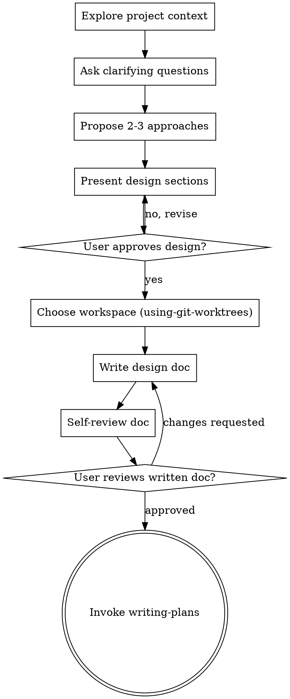

# Brainstorming

Turn an idea into a fully formed design through natural dialogue. Ask questions one at a time. Propose 2–3 approaches. Settle on a design with the user, write it to disk, hand off to writing-plans.

**Announce at start:** "Using brainstorming to turn this idea into a design."

<HARD-GATE>
Do NOT invoke writing-plans, write any code, scaffold any project, or take any implementation action until you have presented a design and the user has approved it. This applies to EVERY project regardless of perceived simplicity.
</HARD-GATE>

## Anti-pattern: "this is too simple to need a design"

Every project that enters this skill goes through the full process. A todo list, a single-function utility, a config change — all of them. "Simple" projects are where unexamined assumptions cause the most wasted work. The design can be short (a few sentences for truly simple things), but you MUST present it and get approval.

(Truly trivial one-off tweaks — a typo, a renamed local, an adjusted constant — never enter brainstorming at all; that's using-playbooks' skip list. But once you're here, don't skip the design.)

## Checklist

Track these as todos and complete them in order:

1. **Explore project context** — files, recent commits, and `docs/followups.md` if it exists (any open followups intersect with this work? fold them in if so). Not a git repo yet? Offer `git init` (ask first) — the pipeline commits its artifacts.
2. **Ask clarifying questions** — one at a time; focus on purpose, constraints, success criteria
3. **Propose 2–3 approaches** — with trade-offs and your recommendation
4. **Present the design in sections** — get user approval after each section
5. **Choose workspace** — invoke **using-git-worktrees**. This happens *before* anything is committed, so the design doc, the plan, and the implementation all land on the feature branch — that's what lets finishing-branch and consolidating-docs find and clean them up later. It waits until after design approval so abandoned brainstorms leave no orphan branches.
6. **Write design doc** — save to `docs/playbooks/designs/YYYY-MM-DD-<topic>.md` and commit
7. **Self-review the doc** — placeholders, contradictions, ambiguity, scope (see below)
8. **Ask the user to review the written doc** — wait for explicit approval
9. **Transition to writing-plans** — invoke that skill; do not invoke any other implementation skill

## Decision flow

The terminal state is invoking **writing-plans**. Do NOT invoke executing-plans, bdd-testing, or any other implementation skill from here. The ONLY skill you invoke after brainstorming is writing-plans.

## How to ask

- Check the project state first (files, recent commits, followups.md)
- If the request describes multiple independent subsystems ("a platform with chat, file storage, billing, and analytics"), flag this immediately and help the user decompose into sub-projects. Each sub-project gets its own design → plan → implementation cycle. Don't spend questions refining details of a project that needs to be split first.
- For appropriately-scoped work, ask one question at a time
- Prefer multiple-choice when possible; open-ended is fine when needed
- Focus on purpose, constraints, success criteria — not implementation details

## How to propose approaches

- 2–3 distinct approaches with their trade-offs
- Lead with your recommendation and the reason for it
- Conversational, not a comparison matrix
- **Failure-mode pass** — for any approach that puts an *unreliable component* on a load-bearing seam (an LLM at a generation/sampling boundary, a heuristic trusted to hold a global/structural invariant), ask: how does it degenerate under real load, and what's the deterministic alternative? If holding it together would need post-hoc patches to force the behaviour, the abstraction is wrong — make the structure deterministic and use the model only for bounded content-fill in a known shape.
  - *"Free composition fenced by invariants" is the classic trap: the fence becomes ten patches.*

## How to present the design

- Once you understand what you're building, present the design in sections
- Scale each section to its complexity — a few sentences for straightforward parts, up to 200–300 words for nuanced ones
- After each section, ask "looks right so far?"
- Cover: architecture, components, data flow, error handling, testing approach
- Be ready to back up and clarify if something doesn't make sense

## Design for isolation and clarity

- Break the system into smaller units, each with one clear purpose, well-defined interfaces, testable independently
- For each unit: what does it do, how do you use it, what does it depend on?
- If a unit's internals leak through its interface, the boundary is wrong
- Smaller, well-bounded units are also easier for an agent to reason about and edit reliably

## Working in existing codebases

- Explore current structure before proposing changes; follow existing patterns
- If existing code has problems that affect this work (oversized file, unclear boundaries, tangled responsibilities), include targeted improvements as part of the design — the way a good developer improves code they're working in
- Don't propose unrelated refactoring; stay focused on what serves the current goal

## Self-review (after writing the doc)

Look at the design doc with fresh eyes:

1. **Placeholder scan** — any "TBD", "TODO", incomplete sections, vague requirements? Fix them.
2. **Internal consistency** — do sections contradict each other? Does the architecture match the feature descriptions?
3. **Scope check** — is this focused enough for a single implementation plan, or does it need decomposition?
4. **Ambiguity check** — could any requirement be interpreted two ways? Pick one and make it explicit.

Fix issues inline. No need to re-review — just fix and move on.

## User review gate

After the self-review:

> "Design written and committed to `<path>`. Please review it and let me know if you want any changes before we move to writing-plans."

Wait for explicit approval. If the user requests changes, make them and re-run the self-review.

## Key principles

- **One question at a time** — don't overwhelm
- **YAGNI ruthlessly** — strip unnecessary features from every design
- **Always 2–3 approaches** — never present a single take as the only option
- **Incremental approval** — present, approve, advance
- **Be flexible** — back up and clarify when something doesn't add up
