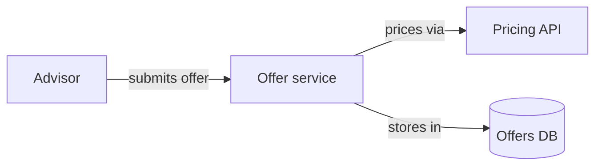
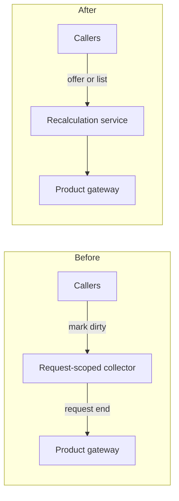
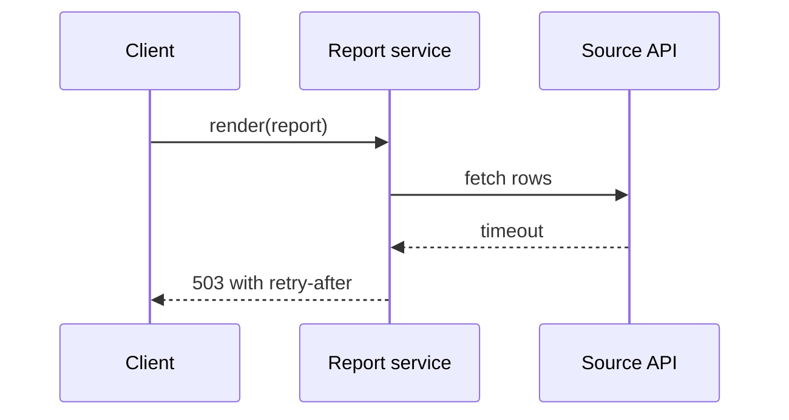
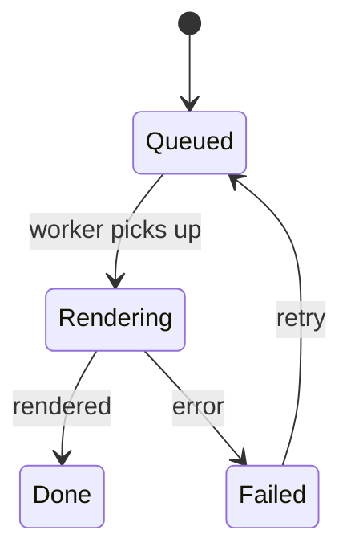
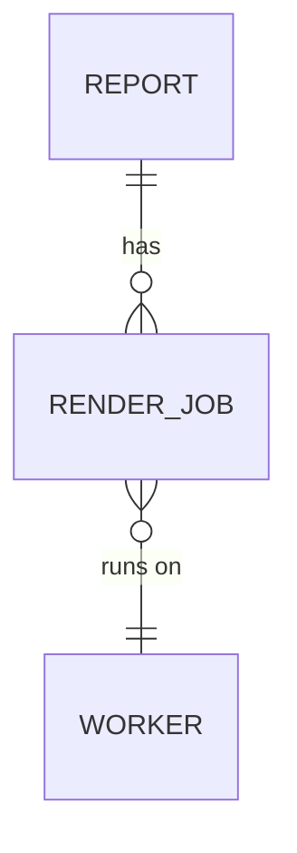
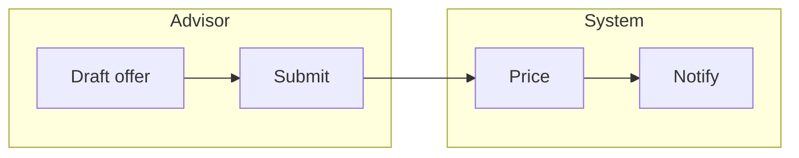

# Design views — which diagram answers which question

Contents: rules for every view · context · structure · behaviour · state · data · process · rollout

A view is a diagram plus the question it answers, stated in the sentence before it. Draw the views a reader needs to understand the problem and the solution —
usually one to three — and none that doesn't change a reader's understanding. The prose after a view explains it; neither is self-sufficient. Mermaid, because
GitHub, GitLab, Bitbucket and the JetBrains preview render it natively; never `dot` in a design — that notation is for skill files, read by the agent.

## Rules for every view

- One idea per diagram. If it needs more than ~15 nodes, split it into two views with two questions.
- Node labels are names, at most four words. Edge labels are verb phrases, at most three — never a bare `uses`.
- No signatures, no ` ` paragraphs, no instance numbers, no styling directives.
- A replacement shows before → after as two subgraphs of one structure view.

## Context — where does the change sit?

Who talks to the system and what the system talks to. The first view for greenfield and infrastructure work, and often the only one a stakeholder reads.

## Structure — what are the parts, and what replaces what?

Components and their dependencies; before and after when something is replaced. The default view for a feature in an existing codebase.

## Behaviour — in what order does it happen?

A request or event travelling through components over time, including the failure path. The view for integrations and for any flow that changes.

## State — what states can it be in, and what moves it?

The lifecycle of one entity, screen or job. The view for user-facing flows and long-running work.

## Data — what is stored, and how does it relate?

Entities and their relations. The view for a data-model change; the migration goes in a rollout view.

## Process — who does what, in what order?

A human or business workflow with roles as lanes. The view when the design changes how people work, not only how code runs.

## Rollout — in what phases does it land?

Not a diagram: a table of phases, what each delivers, and what the old path still serves meanwhile. The view for migrations, infrastructure changes and
initiatives.

| Phase | Delivers                                    | Old path still serves |
|-------|---------------------------------------------|-----------------------|
| 1     | one report type through the new pipeline    | every other type      |
| 2     | the high-volume types                       | the long tail         |
| 3     | the long tail; the old scheduler is deleted | nothing               |
