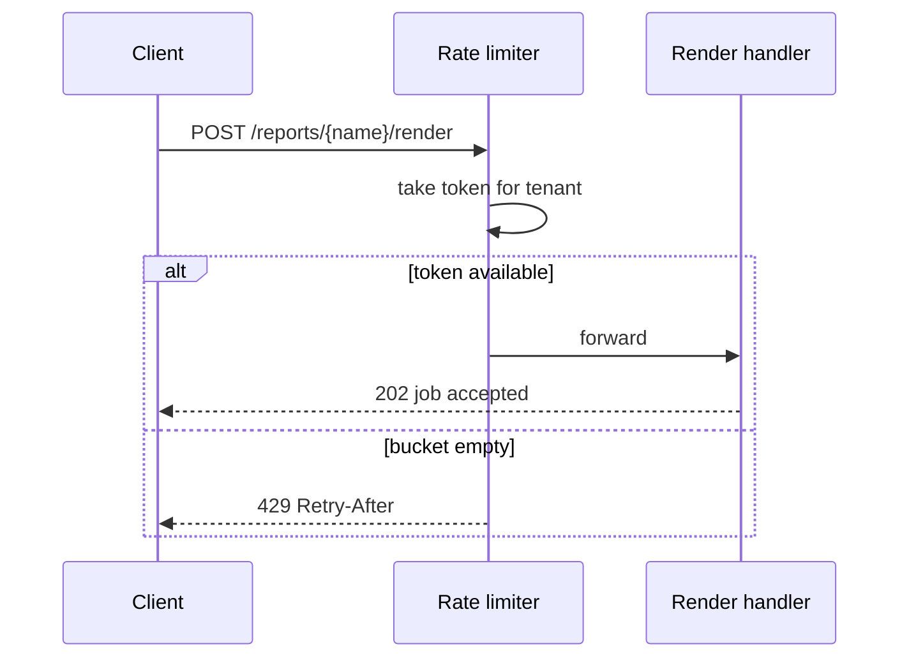

# Example design — a feature in an existing codebase

A new capability added to a running service, with an endpoint, configuration, a changed flow, and a mechanism that is the decision. The narrative a teammate can
follow, then the contracts the implementer must match.

---

# Per-tenant rate limiting on the report API

Status: approved · Ticket: RS-118

## Problem

One tenant's nightly export bursts several thousand render requests into the report API within a minute, and every other tenant's requests wait until the burst
drains. Support has handled this by phone twice this quarter. Done means a tenant that exceeds its allowed rate is told so immediately with a retry hint, and no
tenant under its rate waits on another tenant's burst.

## Diagnosis

The service has no notion of a tenant before work starts: requests are accepted in arrival order into a fixed worker pool, so the first client to arrive in
volume owns the pool until its requests drain, and nothing between the edge and the pool can say no. Fairness cannot be added inside the pool without a
scheduler; it has to be decided before a request is accepted, per tenant, with a bound on bursts as well as on sustained rate.

## Approach

Limit each tenant to a sustained rate with a bounded burst, decided at the API edge before a request reaches the worker pool, using a token bucket per tenant:
tokens refill at the tenant's rate up to a burst capacity, each request spends one, and a request that finds no token is rejected with a retry hint. Limits come
from tenant configuration with a default.

- Fixed window per tenant (N requests per minute) — rejected. A client can spend a full window's allowance in the last second and the next window's in the
  first, so a two-second burst of twice the limit passes; the complaint that started this would not be fixed.
- Fair queueing inside the worker pool — rejected. It fixes fairness but not overload: the burst is still accepted and still occupies memory and connections;
  and it needs a scheduler where a limiter needs a counter. It would become right if we had to guarantee throughput per tenant rather than bound it.

## Decisions

- Limit per tenant, not per API key — a tenant with many keys would otherwise multiply its allowance.
- Reject with 429 and a Retry-After header rather than delaying the request — delaying holds a connection and hides the overload from the client.
- Limits live in tenant configuration with a service-wide default — a global limit alone can't give the enterprise tenant its contracted rate.
- One bucket per tenant per instance, not shared across instances — see Out of scope; the accepted cost is a tenant's effective limit being the per-instance
  limit times the instance count.

## Design

In what order does a request pass the limiter, and where does it stop?



- **RateLimiter** (new) — holds one bucket per tenant, refills lazily on access, and answers allow or deny with the wait until the next token. Owns nothing
  about HTTP.
- **RenderController** (changed) — asks the limiter before queueing a render; turns a deny into the 429 response.
- **TenantConfig** (changed) — gains the rate and burst fields with defaults.
- **Render handler and worker pool** — unchanged.

The refill is the decision, so it is spelled out: no timers, no background thread, and constant work per request, because the bucket computes what it would have
refilled since it was last touched.

```
take(tenant, now):
  b = buckets[tenant] or new bucket(tokens = burst, touched = now)
  b.tokens = min(burst, b.tokens + (now - b.touched) * rate)
  b.touched = now
  if b.tokens >= 1: b.tokens -= 1; return allow
  return deny(wait = (1 - b.tokens) / rate)
```

## Contracts

```java
public interface RateLimiter {
   /** Consumes one token for the tenant. Returns ALLOW, or DENY carrying the seconds until a token is available.
       Never blocks; unknown tenants get the default limit. */
   Decision take(TenantId tenant);
}

public record Decision(boolean allowed, Duration retryAfter) {}
```

```
POST /reports/{name}/render
  → 202 { "jobId": "…" }                      unchanged
  → 429, header Retry-After: <seconds>,       new: tenant over its rate
       body { "error": "rate_limited", "retryAfterSeconds": n }
```

```
tenant configuration (per tenant, defaults service-wide):
  rateLimit.requestsPerSecond   default 20
  rateLimit.burst               default 100
```

**Structural rules**

- The rate limiter has no dependency on the HTTP layer or the render handler; the controller depends on it, not the reverse.
- Tenant configuration is read through the existing config unit; the limiter holds no parsing.
- Bucket arithmetic lives in one function under the map's limits; the controller's deny path is a separate function.

## Guarantees

1. When a tenant has spent its burst and sends another request within the refill time, then it receives 429 with a Retry-After that is at least the true wait.
2. When a tenant is under its rate, then none of its requests is delayed or rejected by another tenant's traffic.
3. When any request passes the limiter, then the limiter did constant work and started no timer or thread.
4. When an instance restarts, then every tenant's bucket starts full — a burst after restart is accepted, and that is the accepted cost of keeping no state.
5. When a tenant has no configured limit, then the service-wide default applies.
6. Must not change: the 202 response, the job queue, and the worker pool.

## Assumptions

- Clients honour Retry-After; the header is advisory and the limiter does not wait for them.
- A tenant is identified before the limiter runs; authentication already establishes it.

## Open questions

- Should the 429 carry the tenant's configured rate in the body so clients can self-tune? Product owner, before milestone 2.

## Risks

- A limit set too low on the enterprise tenant looks like an outage to them; the default and the first per-tenant values need a review with support before
  rollout.
- Rollout: the limiter ships disabled behind the configuration default of no limit, and is enabled per tenant.

## Out of scope

- A limit shared across service instances; it needs a shared store and is its own design.
- Prioritising tenants against each other under overload.
