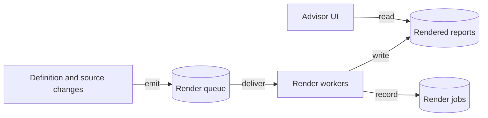
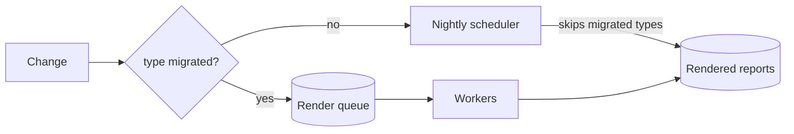

# Example design — an initiative

A legacy nightly scheduler replaced by an event-driven render pipeline, one report type at a time. The target architecture, the coexistence mechanism, the shared contracts. Its roadmap is `../../writing-roadmap/references/example-roadmap.md`; slices get their own designs that link this one.

---

# Event-driven report rendering, replacing the nightly scheduler

Status: approved · Ticket: RS-140 · ADR: `<date>-adr-render-on-change-not-on-schedule.md`

## Problem

Every report is rendered by a nightly job that walks all report definitions and renders each one synchronously, whether or not anything changed. The run takes four hours and grows with the catalogue; a failure halfway leaves the second half stale until the next night; and a report changed at 9 a.m. is not visible until the next morning. Support requests to "re-run the night" are the most common ticket in the service. Done means a report is re-rendered within minutes of a change to its definition or its sources, the nightly job is gone, and a failed render affects only that report.

## Approach

Render on change, not on schedule. A change to a report definition or to a source emits a render request; a queue holds the requests; workers render them independently and retry on failure. The scheduler keeps rendering whatever has not yet moved, type by type, until nothing is left and it is deleted. Rationale in the ADR above.

- Speed up the nightly job by rendering in parallel — rejected. It keeps every report on a nightly cadence and keeps the all-or-nothing run; parallelism shortens the window without fixing the model.
- Incremental nightly job that renders only changed reports — rejected. It fixes the wasted work but not the latency, and the change detection it needs is the same event we would emit anyway; having emitted it, rendering immediately is the smaller step. It would become right if rendering had to be batched for a downstream consumer.

## Decisions

- Routing between old and new is by report type, not by report — a type is the unit the scheduler already iterates, so the split needs no new bookkeeping in the legacy path.
- Delivery is at-least-once with idempotent renders keyed by report and source version — rejected exactly-once because it needs a transactional outbox the sources don't share, while a duplicate render is harmless.
- A render request carries the source versions it was triggered by, so a worker can detect and skip a request already superseded by a newer one.
- The scheduler is the fallback until the last slice, never a parallel path: a migrated type is rendered by the queue only.

## Design

Where does the change sit, and what does the end state look like?



How do old and new coexist while types migrate?



- **Render queue** (new) — holds render requests; at-least-once delivery; dead-letters after the retry budget.
- **Render workers** (new) — render one request at a time, idempotently by report and source version; record a render job per request.
- **Change emitters** (changed) — the definition service and each source adapter emit a render request on change, for migrated types only.
- **Nightly scheduler** (changed, then removed) — skips migrated types; deleted by the last slice with the routing table.
- **Routing table** (new, temporary) — the set of migrated report types, in configuration; read by emitters and by the scheduler.

**The coexistence mechanism.** A report type is either migrated or not, never both. Emitters check the routing table before emitting; the scheduler checks it before rendering. Migrating a type is one configuration change, made after the type's emitters ship, and reverting it is the same change in the other direction: the scheduler renders the type again on the next night and the queue stops receiving for it. Rendered output for unmigrated types stays byte-identical to today's because the scheduler code path for them does not change. State is not duplicated: rendered reports are one store written by either path, and render jobs exist only for the queue path.

## Contracts

```
RenderRequest  { reportId, reportType, sourceVersions: map<sourceId, version>, requestedAt }
                emitted by definition and source adapters; consumed by workers
RenderJob      { jobId, reportId, sourceVersions, state: queued | rendering | done | failed, attempts }
                one per request; state transitions only forward except failed → queued on retry
```

```java
public interface RenderQueue {
   /** Enqueues for at-least-once delivery. Returns the job id; never blocks the emitter. */
   JobId enqueue(RenderRequest request);
}

public interface RoutingTable {
   /** True when the type is rendered by the queue; the scheduler must then skip it. Read from configuration; a missing type is not migrated. */
   boolean isMigrated(ReportType type);
}
```

## Guarantees

1. When a type is migrated, then every change to a report of that type produces a render within the queue's delivery bound, and the scheduler never renders it.
2. When a type is not migrated, then its rendered output is byte-identical to today's.
3. When a render request is delivered twice, then the second render produces the same output and the report is not corrupted in between.
4. When a request arrives whose source versions are older than the report's last render, then it is skipped.
5. When a type's migration is reverted, then the next nightly run renders it and nothing is lost.
6. Types migrate in any order; the coexistence mechanism does not depend on it.
7. Must not change: the rendered report format and the location advisors read from.

## Assumptions

- Every source adapter can tell when its data changed; the two that cannot are handled by a periodic version check inside the adapter, not by the scheduler.
- A duplicate render is cheap enough that at-least-once is acceptable everywhere.

## Open questions

- Retry budget and dead-letter handling — operations, before the first slice's design.
- Whether the render job store is the same database as the reports — before the first slice's design.

## Risks

- The two adapters without change detection are the likely long tail; if their version check is expensive, those types may stay on the scheduler longer than planned.
- Rollout is per type and reversible by configuration; the risk is a type migrated before its emitters ship, which the routing table's ordering rule guards.

## Out of scope

- Rendering priority between tenants.
- Retention of render jobs beyond debugging needs.
