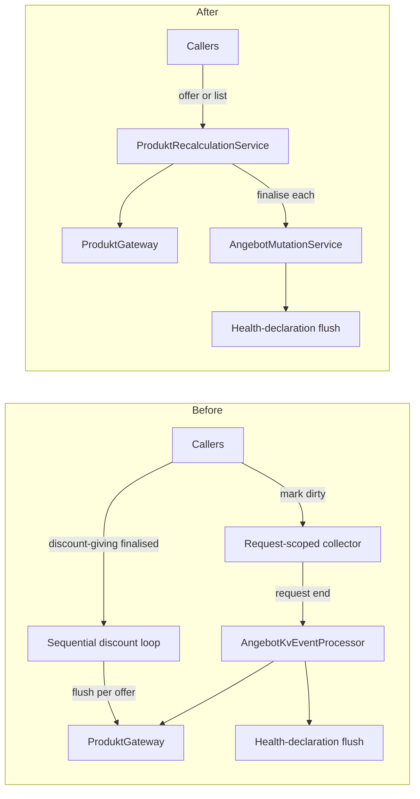

# Example design

A real design in the shape `design-doc.md` gives: a narrative a teammate can follow without the codebase, then the contracts the implementer must match. Its plan is `../../writing-plans/references/example-plan.md`; together the two are complete, and nothing is said twice.

---

# One explicit product-recalculation service, no request-scoped deferral

Status: approved · Ticket: <id> · ADR: `<date>-adr-product-recalculation-without-request-scope.md`

## Problem

When an offer changes, its products must be recalculated; when the discount-giving offer of a family changes, every discount-receiving offer must be recalculated too. Today that happens through two overlapping mechanisms. One defers: callers mark offers dirty in a request-scoped collector and the set is recalculated when the request ends. The other is immediate and sequential: finalising a discount-giving offer loops over its dependents and recalculates and flushes each on its own. The deferral almost never batches — only two flows ever mark more than one offer — the main command path bypasses it entirely, and the sequential loop cannot be parallelised because each iteration flushes inside the request. Two mechanisms for one job, neither doing what its name promises. Done means every caller reaches recalculation through one service, the collector and the sequential loop are gone, and every existing scenario is green.

## Approach

Replace both with one explicit, stateless domain service, ProduktRecalculationService, offering two operations: recalculate one already-loaded offer in memory, or recalculate an explicit list of offers as a batch. The batch orders discount-giving offers before discount-receiving ones — they are its input — and reuses the proven three-phase pattern: read all, compute in memory on worker threads, reconcile and finalise on the main thread. Batch callers name their offers instead of draining hidden request state. Rationale in the ADR above.

- Keep the deferral and route the discount loop through it — rejected. Its batching never materialises, since only two flows ever mark more than one offer, and it keeps the flush point hidden in request state. It would only become right if most callers genuinely batched, which none do.
- Fix the sequential loop's parallelism in place — rejected. The per-item flush inside the loop is exactly what causes the transaction clash, so parallelising it needs the in-memory / finalise split anyway; at that point it is the new service under another name.

## Shape

What replaces what:



- **ProduktRecalculationService** (new) — the only entry point for product recalculation. Single offer: calls the gateway on the loaded instance and reconciles side effects; no reload. Batch: marks each offer's health declaration dirty, splits discount-giving from discount-receiving, recalculates the giving ones first, then runs the three-phase parallel pass over the rest; every recalculated offer is finalised through the mutation service.
- **AngebotMutationService** (changed) — finalise flushes health declarations directly. The event processor that hid the recalculation drain and the flush behind one call is removed.
- **RollenService** (changed) — on a discount-giving finalise it computes the dependent list and hands it to the batch. Its own loop is gone.
- **Callers** (changed) — hand the service one loaded offer or an explicit list. Nobody marks anything dirty any more.
- **Removed** — the request-scoped collector and its service, the event processor, the sequential loop.

## Contracts

```java
@DomainService @Dependent @Transactional
public class ProduktRecalculationService {

   /** One already-loaded offer, recalculated in memory on that instance. No reload, no flush. A gateway failure propagates and leaves the offer unmodified. */
   public void recalculate(Angebot angebot, ProduktCalculationContext context);

   /**
    * Explicit batch. Marks each offer's health declaration dirty, recalculates discount-giving
    * offers first, then the rest in a three-phase parallel pass; finalises every offer with the
    * given editor. Empty list: no-op. An unknown offer number fails the whole batch before any
    * recalculation starts.
    */
   public void recalculateAngebote(List<AngebotNr> angebotNrn, Bearbeiter bearbeiter);
}
```

```java
// AngebotMutationService — signatures unchanged; both overloads now flush health
// declarations directly instead of going through AngebotKvEventProcessor.
public ETag finalisiereAenderung(Bearbeiter bearbeiter, Angebot angebot);
public ETag finalisiereAenderung(Angebot angebot);
```

```java
// RollenService — signature unchanged; delegates to recalculateAngebote instead of looping.
public void calculateRabattnehmendeAngebote(Angebot rabattgebendesAngebot, Bearbeiter bearbeiter);
```

## Guarantees

1. When any caller needs a product recalculation, then it goes through ProduktRecalculationService; no request-scoped state participates.
2. When a batch holds discount-giving and discount-receiving offers, then the giving ones are recalculated first.
3. When a discount-receiving offer is mutated, then its discount-giving offer is not recalculated; only the reverse fans out.
4. When a batch recalculates an offer, then that offer is finalised and its health declaration synchronised exactly as today — the copy flow included.
5. When a batch computes, then computation runs in memory on worker threads and persistence and finalisation happen on the main thread only.
6. When the family-discount, copy, person-data and partner-data scenarios run, then premiums and roles equal today's.
7. Must not change: health-declaration dirty marking, the customer-advisor gate and the synchronous external call at finalise.

## Assumptions

- Every caller that today marks a single offer dirty holds the loaded offer at that point, so the single-offer operation needs no lookup.

## Open questions

- Should a batch skip an unknown offer number or fail as a whole? Contracts say fail-whole; the domain owner confirms by milestone 1.

## Risks

- The discount path has never run in parallel in production. The three-phase split is what makes it safe in theory; the suite has to prove it.
- Callers must now know when they hold a batch; nothing quietly merges marks any more.

## Out of scope

- Lazy health-declaration synchronisation (an earlier, never-implemented ADR) — it stays synchronous.
- The command model, the side-effect reconciler and the product gateway contract.
- Caching in the discount-giving lookup (separate follow-up).
