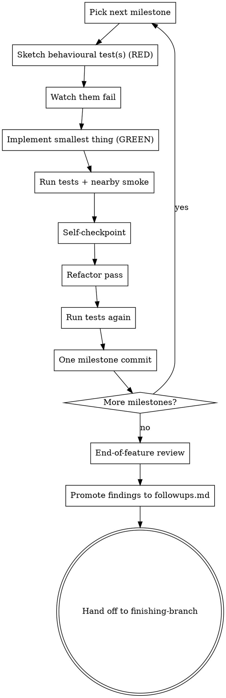

# Executing Plans

Implement the plan in the main session, milestone by milestone. Default execution mode is the main session and main model — not subagents. Subagents are for genuinely parallel or context-heavy subtasks (see **using-parallel-agents**).

**Announce at start:** "Using executing-plans to implement the plan."

## Before you start

1. Read the plan file once. Extract: the goal, the decomposition, the behaviours to verify, the full list of milestones with their done-when criteria.
2. Re-read it critically. Any milestone unclear? Any missing dependency? Any behaviour you can't see how to verify? Raise it with the user before any code is written.
3. Confirm the workspace chosen during brainstorming (branch, path, and the recorded `BASE_SHA` from the using-git-worktrees report). Invoke **using-git-worktrees** now only if there is no workspace yet — e.g. the user brought their own plan and skipped the earlier pipeline stages.
4. Create one TODO entry per milestone for tracking.

## Clean code defaults

These are standing rules that apply during **both** the GREEN step (writing the smallest thing) and the refactor pass (cleaning up). They are not goals to tick at the end — they shape how you write code in the first place.

- **Single Responsibility Principle.** Each function / class / module does one thing. If you describe it with "and", split it.
- **Small functions.** A function should fit on a screen. If you're scrolling to read it, it's too big.
- **Descriptive names.** Names explain *what* something does or returns. `process_data` is bad; `validate_login_payload` is good. Bad names are a refactor signal — rename in place.
- **DRY, but not premature.** Three near-identical pieces → consider extracting. Two → leave them. Premature abstraction is worse than duplication.
- **No dead code, no commented-out code.** Delete it. Git remembers.
- **Boy scout rule.** Leave the code you touched cleaner than you found it. The refactor pass (Step 6) is where you do this deliberately.

The "smallest thing that passes" (Step 3) means smallest *that respects these defaults* — not smallest at any cost. A sprawling 200-line glue function is not the smallest thing; it's the laziest thing.

The refactor pass uses these principles as a lens: did the implementation drift from any of them while reaching green? If yes, fix it before the milestone commit.

## The milestone loop

For each milestone, run this loop in order. Do not skip steps.



### Step 1 — Sketch behavioural test(s) (RED)

Use **bdd-testing** to write the behavioural test for the milestone. One test per behaviour the milestone is supposed to add. Behaviour-level, not structural.

### Step 2 — Watch them fail

Run the test. Confirm it fails for the right reason — the behaviour isn't implemented yet, not because of a typo or a missing import. If the test passes immediately, you're testing existing behaviour — fix the test.

### Step 3 — Implement smallest thing (GREEN)

Write the smallest code that makes the test pass. No premature abstraction. No "while I'm here" features.

### Step 4 — Run tests + nearby smoke

Run the milestone tests + a quick smoke of nearby behaviour. All must pass.

### Step 5 — Self-checkpoint

Re-read the milestone goal from the plan. Look at the diff for *only this milestone*. Answer:
- **Did I meet the goal?** Each done-when criterion?
- **Did I leave anything broken?** Any test elsewhere this change might have affected?
- **Anything surprising worth noting?** Discovered helper, unexpected coupling, sharp edge?

If something's off: fix in place before continuing.
If something's a note for later: add it to your in-session `## Findings` block (see "Findings" below).

"Added X but didn't wire it up at the call sites the plan named" is incomplete milestone work, not a finding — fix it now.

### Step 6 — Refactor pass

Spend a few minutes looking around the area you just touched and improve what you can. Boy scout rule: leave it better than you found it.

**Scope:** the neighbourhood of what you touched. Same file, the function above and below, the helpers you called, immediate callers. NOT random distant files. NOT the whole module.

**Time-box:** ~5–10 minutes. If you find something bigger, capture it as a finding (`## Findings → Open questions`) and move on.

**Allowed moves:** rename for clarity, extract a small helper, collapse obvious duplication, remove dead code, simplify a conditional, tighten a comment.

**Not allowed:** redesign interfaces, restructure modules, change architecture, sweeping pattern "improvements". Those need a milestone of their own.

**Tests stay green throughout.** Refactoring is behaviour-preserving by definition. Bug found while refactoring? That's a finding, not a silent fix.

**It's OK to find nothing.** "Looked, nothing worth doing" is a valid answer. Don't force a refactor when there's nothing to do.

### Step 7 — Run tests again

Verify the refactor didn't break anything. Use **verifying-before-done** before claiming the milestone is complete.

### Step 8 — One milestone commit

Invoke **milestone-commits**, then write one commit for the entire milestone (feature + refactor). The plan's milestone titles and identifiers are reasoning scaffolding for *you* — they do not belong in the commit subject. Describe the outcome with a Conventional Commits type.

### Repeat for each milestone.

## Findings: Tier 1 (in-session) and Tier 2 (followups.md)

Findings come in two flavours:

**Tier 1 — In-session findings** (useful within the current feature).
Maintain a running `## Findings` block in the conversation as you work. Three subsections:
- **Changes** — what was done (per milestone)
- **Gotchas** — things future milestones / future work should know
- **Open questions** — refactor items deferred, design questions, anything skipped

This block is part of the input to the end-of-feature reviewer subagent.

**Tier 2 — Durable followups** (outlive the feature).
Live at `docs/followups.md`. Append-only. Only items that would need their own design / plan to address — architectural refactorings, generalizations, structural changes. Anything fixable in a boy-scout pass is in scope of the current feature; do not promote it. Format:

````markdown
## YYYY-MM-DD — short title
One-line description. File: src/path/file.py:line. Discovered while: feature-name.
````

## End-of-feature review

After the last milestone commits, run a single review pass before `finishing-branch`:

1. Dispatch ONE reviewer subagent using the companion prompt `end-of-feature-reviewer-prompt.md` that ships alongside this skill (in the plugin's `skills/executing-plans/` directory). The reviewer gets: the design doc, the plan, the full feature diff (`BASE_SHA..HEAD` — `BASE_SHA` is the value recorded in the using-git-worktrees report), and the in-session `## Findings` block.
2. Review returns: Strengths / Issues (Critical / Important / Minor / Followup) / Assessment.
3. Fix Critical, Important, and Minor. Only Followup-tier items go to `followups.md` (per the Tier-2 definition above).
4. Commit the fixes as one "review fixes" milestone (same loop: self-checkpoint, refactor pass if applicable, one commit).
5. **Do not re-dispatch the reviewer.** One pass, fix, move on. If the fixes are large enough that you instinctively want a re-review, that's a signal a milestone was wrong; don't re-loop.

## Promotion: Tier 1 → Tier 2

After the end-of-feature review and its fixes:

1. Read your in-session `## Findings` block.
2. Drop anything that was addressed during the work.
3. Promote only Tier-2 items per the definition above. Anything else gets fixed in a small follow-up commit or dropped.
4. Commit the followups update.

## Hand off

Invoke **finishing-branch** to complete the work.

## When to use a subagent during execution

Default: don't. Stay in the main session.

Dispatch a subagent only when:
- 2+ genuinely independent failing tests need investigation in parallel (use **using-parallel-agents**)
- A subtask will produce a lot of context noise (large log parses, broad codebase searches), and the *findings* are what you care about — not the noise

Required output from any dispatched subagent: a `## Findings` block with `Changes / Gotchas / Open questions`. Store the findings inline in the main session before the next milestone — that's what keeps context flowing.

## Red Flags — STOP

| Thought | Reality |
|---------|---------|
| "I'll skip the test, this case is obvious" | Then the test takes 30 seconds. Write it. |
| "I'll commit the feature now and refactor later" | Refactor is part of the milestone commit. Do it now. |
| "The refactor pass found nothing — but I'll improve this anyway" | That's scope creep. Note it as a followup. |
| "I'll let the end-of-feature review catch it" | Self-checkpoint catches things while context is loaded. Use it. |
| "I'll dispatch a subagent to make this faster" | Default to main session. Subagents are situational. |
| "I'll re-run the reviewer until it's perfect" | One pass, fix, move on. |
| "I'll skip the verification because tests passed locally last time" | Run **verifying-before-done** every time. No exceptions. |
| "It's pre-existing, my change didn't introduce it" | Boy-scout rule. Pre-existing ≠ out-of-scope. |
