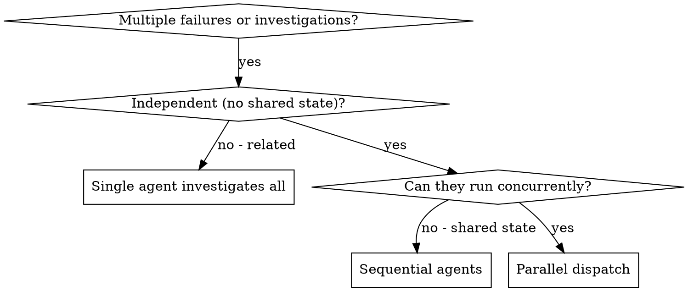

# Using Parallel Agents

Subagents are specialized workers with isolated context. By precisely crafting their instructions, you keep them focused and preserve your own context for coordination work.

When you have multiple unrelated failures or independent investigations, doing them sequentially wastes time. One subagent per problem domain. Concurrent dispatch.

**Core principle:** One agent per independent problem. Parallel where possible.

## When to use



**Use when:**
- 2+ test files failing with different root causes
- Multiple subsystems broken independently
- Each problem can be understood without context from the others
- Investigations would all touch different files / modules

**Don't use when:**
- Failures might be related (fixing one might fix others — investigate together first)
- You need full system state to understand the issue
- Subagents would interfere (editing the same files, racing on resources)
- The work is exploratory and you don't yet know what's broken

## The pattern

### 1. Identify independent domains

Group the failures or tasks by what's broken or what needs to be done. Each domain must be understandable without the others:
- File A tests: tool approval flow
- File B tests: batch completion behaviour
- File C tests: abort functionality

Fixing tool approval doesn't affect abort tests — those are independent.

### 2. Craft focused subagent prompts

Each subagent gets:
- **Specific scope** — one test file, one subsystem
- **Clear goal** — what success looks like
- **Constraints** — don't change other code; don't redesign
- **Required output** — a `## Findings` block (see below)

A good prompt is:
1. Focused — one clear problem domain
2. Self-contained — paste error messages, test names, the relevant snippet
3. Specific about output

Example:
```
Fix the 3 failing tests in src/agents/agent-tool-abort.test.ts:

1. "should abort tool with partial output capture" — expects 'interrupted at' in message
2. "should handle mixed completed and aborted tools" — fast tool aborted instead of completed
3. "should properly track pendingToolCount" — expects 3 results but gets 0

These look like timing / race conditions. Your task:
1. Read the test file and understand what each test verifies.
2. Identify root cause — timing or actual bugs?
3. Fix by replacing arbitrary timeouts with event-based waiting,
   or fix the abort implementation if it's a real bug.

Do NOT just increase timeouts — find the real issue.

Return: a `## Findings` block with Changes / Gotchas / Open questions.
```

### 3. Dispatch in parallel

Send all subagent dispatches in a single response (multiple tool calls in one message) so they run concurrently. Sequential dispatches defeat the point.

### 4. Review and integrate

When subagents return:
- Read each Findings block
- Check for conflicts (did they edit the same code?)
- Run the full test suite
- Integrate the changes; record their findings in the parent session

## Required output: the Findings block

Every subagent must return:

- **Changes** — files touched, one-line summary per file
- **Gotchas** — things future work should know (existing utilities discovered, naming conventions, sharp edges)
- **Open questions** — anything they couldn't resolve

The parent stores these inline before the next step. This is what keeps context flowing across subagent boundaries — without it, every subagent dispatch loses what was learned.

## Common mistakes

| Bad | Good |
|-----|------|
| "Fix all the tests" | "Fix agent-tool-abort.test.ts (3 specific failures listed)" |
| No context — "fix the race condition" | Paste error messages, test names, relevant snippet |
| No constraints — agent restructures everything | "Do NOT change production code" / "Fix tests only" |
| Vague output — "fix it" | "Return a Findings block with Changes / Gotchas / Open questions" |

## Red Flags

**Never:**
- Dispatch parallel subagents that touch the same files (they will conflict)
- Dispatch parallel subagents when you don't yet know what's broken (exploration is sequential)
- Trust a subagent's report without checking the diff and running the tests
- Skip the integration step — running each subagent's tests in isolation is not enough
- Forget to record the Findings blocks in the parent session before moving on
