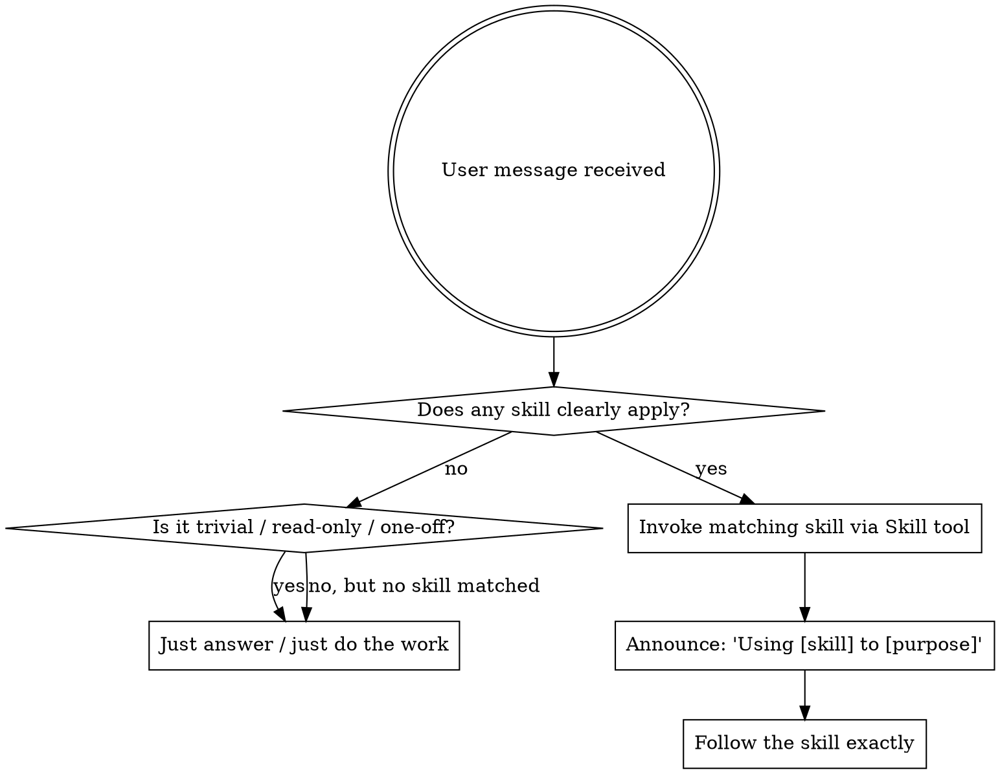

<SUBAGENT-STOP>
If you were dispatched as a subagent for a specific task, skip this skill — your dispatcher already gave you what you need.
</SUBAGENT-STOP>

<EXTREMELY-IMPORTANT>
When a skill clearly applies to the work in front of you, you MUST invoke it via the `Skill` tool BEFORE responding or taking action.

This is not optional. You do not get to "do the work first and invoke the skill afterwards." Skills shape *how* the work is done — running them after is too late.

The skip carve-out below is explicit and limited. Read it. Apply it. Do not extend it by analogy to talk yourself out of invoking a skill that applies.
</EXTREMELY-IMPORTANT>

# Using Playbooks

You have access to **playbooks** — a small library of workflow skills loaded into this session. Each skill is a reference guide for a specific kind of work.

## Priority

User instructions in CLAUDE.md / AGENTS.md / direct messages always take precedence over a skill. Skills override the default system behaviour where they conflict.

## Decision flow

## When to invoke

| Trigger | Skill |
|---------|-------|
| Starting non-trivial creative work (new feature, new component, behaviour change) | **brainstorming** (then **writing-plans** → **executing-plans**) |
| Fixing a bug / investigating a failure | **debugging** |
| About to claim "done" / "fixed" / "passing" / "complete" | **verifying-before-done** |
| Finishing a feature branch (merge / PR / cleanup) | **finishing-branch** |
| Cleaning up accumulated design / plan docs into real documentation | **consolidating-docs** |
| 2+ genuinely independent investigations runnable in parallel | **using-parallel-agents** |

The creative-work pipeline is **brainstorming → writing-plans → executing-plans**, in that order. Do not skip brainstorming and start writing code. Do not skip writing-plans and start executing.

## When to skip

Do *not* invoke a skill for:
- **Clarifying / informational questions** — "what does this function do?", "where is X defined?"
- **Small read-only exploration** — listing a directory, reading a file, grepping for a symbol
- **One-off tweaks that don't match any skill** — renaming a local variable, fixing a typo, adjusting a constant
- **Continuing inside a skill that's already running** — sub-skills are referenced by the active skill; you don't need to re-invoke from the top

The bar is **clearly applies**, not *might apply if I squint*. If you have to argue for it, the skill probably doesn't apply — but if you're arguing *against* it, that's a Red Flag (see below).

## Red Flags — these thoughts mean STOP

| Thought | Reality |
|---------|---------|
| "I'll skip the skill, this is faster" | Speed ≠ correctness. If a skill applies, invoke. |
| "I already know what the skill would say" | Knowing the concept ≠ running the workflow. Invoke. |
| "I'll do the work first, then invoke the skill" | Skills shape the work. After is too late. |
| "This task is too small for the full skill" | If it applies, it applies. Skills scale to the task. |
| "I'll just check / just look / just try first" | "Just" is rationalization. The check is the work. |
| "This is technically a small change" | Small ≠ trivial. Behaviour changes need brainstorming. |
| "I need more context before invoking" | The skill tells you HOW to gather context. Invoke first. |

## The library

**Process** (how to approach the work):
- **brainstorming** — turn an idea into a design through clarifying questions and proposed approaches.
- **writing-plans** — turn an approved design into an intent-shaped implementation plan.
- **executing-plans** — work the plan in the main session, milestone by milestone, with self-checkpoints, a refactor pass, and an end-of-feature review.
- **debugging** — reproduce, state the root cause with evidence, pin it with a red-first regression test, then fix.
- **finishing-branch** — verify tests, then present a fixed menu (merge / PR / keep / discard).
- **consolidating-docs** — graduate durable decisions from design/plan files into the repo's real docs, then delete the husks. Fired by finishing-branch when landing work; also invocable to sweep the backlog.

**Implementation** (how to do the work):
- **using-git-worktrees** — pick a workspace mode (default: new worktree on a new feature branch). Fired from brainstorming after design approval, before anything is committed.
- **bdd-testing** — write behaviour-shaped tests for code with interesting logic. Skip for data-only constructs.
- **milestone-commits** — one commit per meaningful slice; the message describes the *why*.

**Cross-cutting** (always-apply):
- **verifying-before-done** — run the verification command and read the output before claiming work is complete.

**Situational**:
- **using-parallel-agents** — dispatch focused subagents in parallel for genuinely independent investigations.

## Documentation

When you add, move, or substantially change documentation, consult `.claude/documentation.md` if it exists — it describes where docs live and how they're maintained in this repo. The **consolidating-docs** skill uses it as a routing map.

## How to invoke

Use the `Skill` tool with the skill's name (no leading slash). Then announce: *"Using [skill-name] to [purpose]."* Follow the loaded content directly. Don't open SKILL.md files with `Read`.
